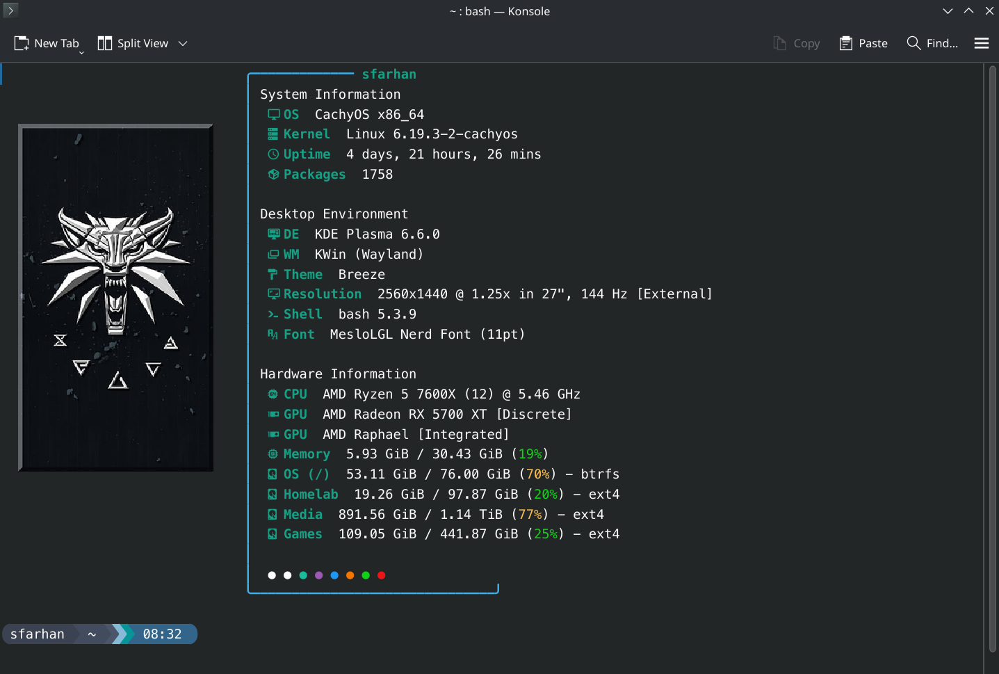

## My Custom Bash Setup for CachyOS (Arch)

A curated setup combining Chris Titus's Bash logic with Dacrab's Fastfetch visuals.

## Components & Credits

#### Bash (`.bashrc`) & Prompt (Starship)
- **Source/Inspiration:** [ChrisTitusTech/mybash](https://github.com/ChrisTitusTech/mybash)
- **Files I Clone:** `.bashrc`, `starship.toml`

#### Fastfetch
- **Source/Inspiration:** [dacrab/fastfetch-config](https://github.com/dacrab/fastfetch-config)
- **Files I Clone:** Custom `.jsonc` config

---

## Prerequisites (Day Zero)

Before cloning the files, I ensure that my system has the required dependencies and fonts.

### Check Dependencies
Run this one-liner to check for missing packages or commands:

```bash
for i in bash tar bat tree unzip fc-list fontconfig bash-completion fastfetch starship fzf trash-cli multitail zoxide ripgrep; do if pacman -Qi "$i" &>/dev/null; then echo "[OK-PKG] $i"; elif type -P "$i" &>/dev/null; then echo "[OK-CMD] $i"; else echo -e "\e[31m[MISSING] $i\e[0m"; fi; done

```

**Example Output:**

```text
[OK-PKG] bash
[MISSING] starship
[MISSING] trash-cli

```

### Install Missing Packages

If any items were `[MISSING]` above, install them (using `yay` covers both official repos and the AUR):

```bash
yay -S starship trash-cli multitail

```

### Install a Nerd Font

A Nerd Font is strictly required for the Starship prompt icons to render correctly.

* **Search** for a font (e.g., Meslo, JetBrains, Hack):
```bash
pacman -Ss nerd | grep meslo  

```

* **Install** (Example for Meslo):
```bash
sudo pacman -S ttf-meslo-nerd

```

* **Verify** installation:
```bash
fc-list | grep -i "meslo"

```

## Deployment: The Symlink Method

Instead of copying files, can consider symlinking them.

Assuming this repository is cloned to `/mnt/pool01/homelab/systems`, run the following commands:

```bash
# 1. Fastfetch (Create directory if missing, then symlink chosen config)
mkdir -p ~/.config/fastfetch
ln -sf /mnt/pool01/homelab/systems/fastfetch/custom-config.jsonc ~/.config/fastfetch/config.jsonc

# 2. Starship Prompt
ln -sf /mnt/pool01/homelab/systems/starship/starship.toml ~/.config/starship.toml

# 3. Bash Configuration (Backup existing first)
mv ~/.bashrc ~/.bashrc.bak
ln -sf /mnt/pool01/homelab/systems/bash/.bashrc ~/.bashrc

```

### Fastfetch Configuration

If using a terminal that supports image rendering (like Kitty or Konsole), adjust the `logo` path near the top of the chosen `config.jsonc` file to point to the custom asset:

```json
  "logo": {
    "type": "kitty",
    "source": "/mnt/pool01/homelab/systems/assets/customlogo.png",
    "width": 25,
    "height": null,
    "preserveAspectRatio": true,
    "padding": {
      "top": 3,
      "left": 2,
      "right": 4
    }
  },

```

The default is like so, if wish to go basic:

```json
  "logo": {
    "padding": {
      "top": 2,
      "left": 1,
      "right": 2
    }
  },

```



*To apply logo changes, run: `fastfetch --logo-recache`*

## Bash Setup Customizations

This `.bashrc` file has been heavily tailored to remove unnecessary bloat from the [original upstream source](https://github.com/ChrisTitusTech/mybash/blob/main/.bashrc), leaving behind only the functionalities and additions I personally require for my environment.

To apply changes and load:

```bash
source ~/.bashrc
```


